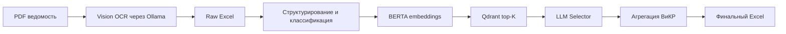

# ГрафИТ

**ГрафИТ** — веб-система для автоматической обработки ведомостей объемов работ: загружаете PDF, а на выходе получаете структурированный Excel с подобранными видами и комплексами работ ВиКР.

Проект закрывает ручную рутину инженера-сметчика и проектной команды: извлекает таблицы из PDF, нормализует позиции, классифицирует строки, ищет релевантные ВиКР через векторный поиск и уточняет выбор локальной LLM-моделью.

Текущая версия — рабочий MVP. Модели и правила проверялись на ограниченной
выборке проектной документации; в обучении использовались марки РД: АС, КЖ,
КМ, а также ТХ в малом объеме.

## Что умеет

- Загружает PDF с ведомостью объемов работ через веб-интерфейс.
- Распознает таблицы через Vision-модель в роли OCR, запущенную локально через Ollama.
- Сохраняет промежуточные результаты каждого этапа в Excel.
- Классифицирует позиции как работы или материалы.
- Ищет top-K кандидатов ВиКР через BERTA-эмбеддер и Qdrant.
- Выбирает лучший вариант через LLM Selector.
- Агрегирует финальную таблицу по кодам ВиКР.
- Показывает прогресс, логи и готовые файлы прямо в браузере.

## Демо-сценарий

1. Откройте веб-интерфейс.
2. Загрузите PDF ведомости.
3. Запустите полный конвейер или отдельные этапы.
4. Скачайте результат из раздела «Результаты».

Главная страница доступна по адресу: `http://localhost:7860`.

## Архитектура



## Быстрый запуск интерфейса

Интерфейс можно запустить сразу после установки зависимостей. Полная обработка PDF потребует модели, Qdrant и Ollama, описанные ниже.

Если вы запускаете уже существующую локальную папку проекта:

```powershell
cd G:\Gratio_No_Gratio\gradio
```

Если устанавливаете проект с GitHub:

```powershell
git clone https://github.com/KonstantinBab/GraphIT.git
cd GraphIT
```

Затем создайте окружение и установите зависимости:

```powershell
python -m venv .venv
.\.venv\Scripts\Activate.ps1
pip install -r requirements.txt

python app.py
```

Откройте:

```text
http://localhost:7860
```

Для Linux/macOS:

```bash
python3 -m venv .venv
source .venv/bin/activate
pip install -r requirements.txt
python app.py
```

## Полный запуск пайплайна

Для реальной проверки обработки PDF нужны внешние компоненты:

- Python 3.10 или новее.
- Poppler, доступный из `PATH`, или путь в `GRAPHIT_POPPLER_PATH`.
- Ollama с Vision-моделью для OCR и LLM-моделью для структурирования.
- Qdrant с коллекцией ВиКР.
- Локальные ML-артефакты:
  - BERTA embedder;
  - LLM Selector LoRA adapter;
  - classifier adapter;
  - справочник `docs/vikr_full.xlsx`.

### Используемые Ollama-модели

В текущей рабочей MVP-конфигурации запускаются две локальные модели через
Ollama:

| Этап | Переменная | Модель | Назначение |
| --- | --- | --- | --- |
| OCR PDF-страниц | `GRAPHIT_OCR_MODEL` | `qwen3.5:27b` | Vision-модель читает изображения страниц PDF и переписывает таблицы ведомости |
| Вспомогательное LLM-структурирование | `GRAPHIT_MERGE_MODEL` | `gemma3:4b-it-fp16` | помогает структурировать/нормализовать извлеченные строки |

Эти значения заданы по умолчанию в [config.py](config.py) и продублированы в
[.env.example](.env.example). Для повторения текущей конфигурации используйте:

```text
GRAPHIT_OCR_MODEL=qwen3.5:27b
GRAPHIT_MERGE_MODEL=gemma3:4b-it-fp16
```

Рекомендуется начинать именно с этих моделей: промпты OCR и структурирования,
формат ожидаемых ответов и постобработка в текущем MVP написаны и проверялись
под `qwen3.5:27b` и `gemma3:4b-it-fp16`. При замене моделей может потребоваться
адаптация промптов и дополнительная проверка качества.

Обученные модели не хранятся в Git-истории. Их рекомендуется публиковать
отдельно через GitHub Release как архивы. Подробная инструкция: [MODEL_RELEASE.md](MODEL_RELEASE.md).

Важно: скачивание release-архивов не дает права распространять, изменять,
использовать коммерчески или создавать производные работы. Любое использование
кода и обученных моделей разрешено только с предварительного письменного
согласия автора.

### 1. Настройте переменные окружения

Скопируйте пример:

```powershell
Copy-Item .env.example .env
```

Заполните пути в `.env`, затем выставьте переменные в текущей сессии PowerShell:

```powershell
Get-Content .env | ForEach-Object {
  if ($_ -and -not $_.StartsWith("#")) {
    $name, $value = $_.Split("=", 2)
    [Environment]::SetEnvironmentVariable($name, $value, "Process")
  }
}
```

Можно также задавать переменные вручную:

```powershell
$env:GRAPHIT_EMBEDDER_PATH="D:\models\berta_finetuned_v6_second\final"
$env:GRAPHIT_SELECTOR_PATH="D:\models\selector_finetuned_7b_v6\final"
$env:GRAPHIT_CLASSIFIER_PATH="D:\models\classifier_llm_v7\final"
```

### 2. Запустите Qdrant

Через Docker:

```bash
docker run -p 6333:6333 -p 6334:6334 qdrant/qdrant
```

Коллекция по умолчанию: `vikr_v6`. Ее можно поменять через `GRAPHIT_QDRANT_COLLECTION`.

### 3. Запустите Ollama и Vision OCR

```bash
ollama serve
ollama pull qwen3.5:27b
ollama pull gemma3:4b-it-fp16
```

В проекте `qwen3.5:27b` используется как Vision-модель для OCR: PDF
разбивается на изображения страниц, после чего модель переписывает табличные
данные в текстовую структуру. Страница модели в каталоге Ollama:
[qwen3.5:27b](https://ollama.com/library/qwen3.5:27b).

`gemma3:4b-it-fp16` используется для вспомогательного LLM-этапа
структурирования. Промпты структурирования в текущей версии написаны под эту
модель, поэтому замена возможна, но требует повторной проверки формата ответа.
Названия моделей можно поменять в `.env`:

```text
GRAPHIT_OCR_MODEL=qwen3.5:27b
GRAPHIT_MERGE_MODEL=gemma3:4b-it-fp16
```

Проверить, что модель скачалась и доступна:

```bash
ollama list
ollama run qwen3.5:27b
```

### 4. Запустите приложение

```powershell
python app.py
```

## Конфигурация

Основные параметры читаются из переменных окружения:

| Переменная | Назначение | По умолчанию |
| --- | --- | --- |
| `GRAPHIT_HOST` | адрес веб-сервера | `localhost` |
| `GRAPHIT_PORT` | порт веб-сервера | `7860` |
| `GRAPHIT_EMBEDDER_PATH` | путь к BERTA embedder | `../augmentation/berta_finetuned_v6_second/final` |
| `GRAPHIT_SELECTOR_PATH` | путь к LoRA Selector | `../train_selector/selector_finetuned_7b_v6/final` |
| `GRAPHIT_CLASSIFIER_PATH` | путь к классификатору | `../train_classification/classifier_llm_v7/final` |
| `GRAPHIT_CODES_FILE` | справочник ВиКР | `docs/vikr_full.xlsx` |
| `GRAPHIT_QDRANT_HOST` | адрес Qdrant | `localhost` |
| `GRAPHIT_QDRANT_PORT` | порт Qdrant | `6333` |
| `GRAPHIT_QDRANT_COLLECTION` | коллекция Qdrant | `vikr_v6` |
| `GRAPHIT_OLLAMA_URL` | URL Ollama | `http://localhost:11434` |
| `GRAPHIT_OCR_MODEL` | Vision-модель для OCR через Ollama | `qwen3.5:27b` |
| `GRAPHIT_MERGE_MODEL` | модель структурирования | `gemma3:4b-it-fp16` |
| `GRAPHIT_POPPLER_PATH` | путь к Poppler | пусто, используется `PATH` |

## Структура проекта

```text
.
├── app.py                 # FastAPI + статический веб-интерфейс
├── app_gradio.py          # альтернативный Gradio-интерфейс
├── pipeline_new.py        # orchestration: parse -> struct -> match -> aggregate
├── parse_class.py         # OCR PDF через Ollama
├── struct_class.py        # классификация работа/материал
├── matcher_new.py         # BERTA + Qdrant + LLM Selector
├── aggregator_class.py    # агрегация результата
├── config.py              # конфигурация и env overrides
├── static/                # HTML/CSS/JS интерфейса
└── docs/vikr_full.xlsx    # справочник ВиКР
```

## Ограничения

- Репозиторий не включает тяжелые веса моделей. Их нужно скачать или обучить отдельно и указать пути через `.env`.
- `matcher_new.py` работает в offline-режиме Hugging Face, поэтому базовая LLM должна быть доступна локально или в локальном HF-кэше.
- Для GPU-инференса нужны совместимые версии PyTorch/CUDA. На CPU проект может запускаться, но полный пайплайн будет медленным.
- `bitsandbytes` может требовать отдельной настройки на Windows. Если используете CPU-only режим, проверьте параметры загрузки моделей.
- Это рабочий MVP, а не промышленная система «из коробки». Обучающая выборка
  покрывала прежде всего марки РД АС, КЖ, КМ; марка ТХ использовалась в малом
  объеме, поэтому на других марках и форматах документов требуется дополнительная
  проверка качества.

## Для чего это можно использовать

- Быстрая подготовка ведомостей к сопоставлению с корпоративным справочником работ.
- Сокращение ручной проверки однотипных позиций.
- Прототипирование AI-помощника для сметчиков, ПТО и проектных офисов.
- Демонстрация end-to-end пайплайна: OCR, LLM, embeddings, vector search и Excel-выгрузка.

## Статус

Проект подготовлен как рабочий MVP и исследовательско-прикладной прототип.
Перед промышленным использованием проверьте качество распознавания, полноту
справочника, правила классификации, покрытие нужных марок РД и безопасность
обработки документов.

## License

All rights reserved.

Use, copying, modification, distribution, commercial use, or creation of
derivative works from the source code, trained models, adapters, weights,
datasets, release assets, and related project materials is allowed only with
prior written permission from the author.
